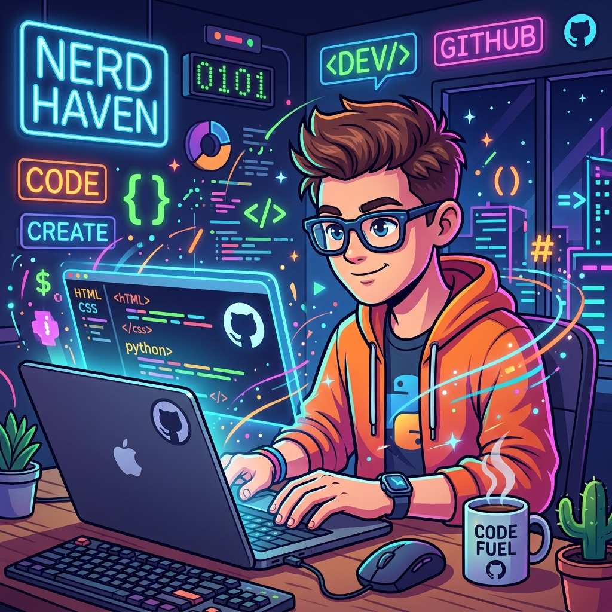

  <!-- The image below will appear perfectly once you upload the picture from your Desktop to your GitHub repo! -->
  

  # Hi there!  I'm Yagya
  
  

 

## 🛠️ Tech Stack & Tools

  

 

## 📊 My GitHub Stats

  
  

 

## 🌟 Top Languages

  

 

  

